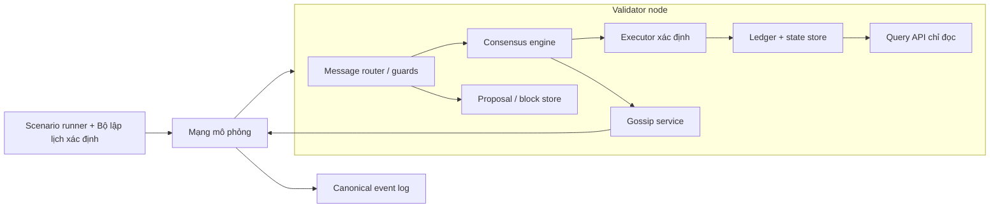

# Kiến Trúc Hệ Thống

## Các module logic

---

## Trách nhiệm và interface của từng module

| Module | Sở hữu | Đầu vào | Đầu ra |
|---|---|---|---|
| Scenario runner | seed, topology, lịch lỗi, assertions | cấu hình kịch bản | nodes, hàng đợi sự kiện xác định, báo cáo cuối |
| Mạng mô phỏng | kết nối, quy tắc delay/drop/duplicate/rate | các gói tin gửi đi | sự kiện giao gói theo thứ tự và log mạng |
| Message router | guards xác thực và cấu trúc | gói tin được giao | thông điệp chấp nhận cho owner, sự kiện từ chối |
| Block store | headers, bodies, candidate đang chờ | header/body hợp lệ | candidate hoàn chỉnh có thể truy xuất |
| Consensus engine | height/round, tập vote, locks, timers | proposals/votes/timers hợp lệ | votes, chuyển đổi trạng thái, quyết định finalize |
| Executor | trạng thái chuẩn và quy tắc nonce | trạng thái parent + giao dịch đã sắp xếp | post-state, state hash, kết quả xác thực |
| Ledger/state store | chuỗi đã finalize, trạng thái đã commit | block đã finalize | snapshot bền vững, phản hồi query |
| Event log | append-only | mọi sự kiện quan sát được | file JSON Lines chuẩn |

> **Nguyên tắc cốt lõi:** Không module nào được truy cập dữ liệu của node khác. Mọi tương tác giữa các node đều phải qua thông điệp tường minh trong mạng mô phỏng — đây là yếu tố thiết yếu để kiểm thử xử lý lỗi trung thực.

---

## Luồng thông điệp

1. **Proposer** chọn giao dịch đang chờ (deterministic), thực thi cục bộ, ký header, rồi broadcast `HEADER` trước `BLOCK_BODY`.
2. **Router của receiver** kiểm tra hình dạng gói, chain ID, danh tính người gửi, chữ ký và các trường đặc thù của thông điệp. Ghi log và bỏ qua các lỗi.
3. **Block store** chỉ liên kết body với header đã được chấp nhận trước đó. Executor xác thực candidate hoàn chỉnh.
4. **Consensus** ghi vote hợp lệ theo tuple và chỉ phát vote tiếp theo nếu signing guard cho phép.
5. **Quorum precommit** kích hoạt xác thực cuối, commit durable ledger/state, và tạo sự kiện `FINALIZE`. Finalization sau đó được gossip.

---

## Mô hình mô phỏng xác định (Deterministic Simulation)

- Bộ lập lịch sở hữu một priority queue sắp xếp theo `(logical_time, insertion_sequence)`.
- Mọi quyết định ngẫu nhiên của mạng đều lấy từ PRNG có seed do scenario runner sở hữu.
- Lặp validators, peers, messages, và transaction pools theo thứ tự bytes/chuẩn — **không bao giờ** theo thứ tự lặp của map.
- Logical time (không phải wall-clock time) điều khiển timeout. Điều này làm cho replay byte-identical.

---

## Ranh giới lưu trữ (Persistence Boundary)

- Milestone đầu: dùng file hoặc embedded database sau `LedgerStore`; phần còn lại của node không được biết implementation.
- Chỉ commit một snapshot sau khi block đã finalize: chain head, serialized state, sender nonce map, và block record.
- Dữ liệu đang chờ chỉ là cache. Khi mô phỏng crash, xây lại từ traffic mạng trong khi giữ nguyên snapshot đã finalize.

---

## Ranh giới bảo mật (Security Boundary)

- Router xử lý mọi thông điệp nhận được như là **thù địch**, kể cả thông điệp được gán cho một validator đã biết.
- Router **không bao giờ** tin vào metadata người gửi từ mạng thay vì chữ ký xác minh bằng public key.
- Các query chỉ đọc chỉ expose trạng thái đã finalize và tách biệt với ingress thông điệp giao thức.
